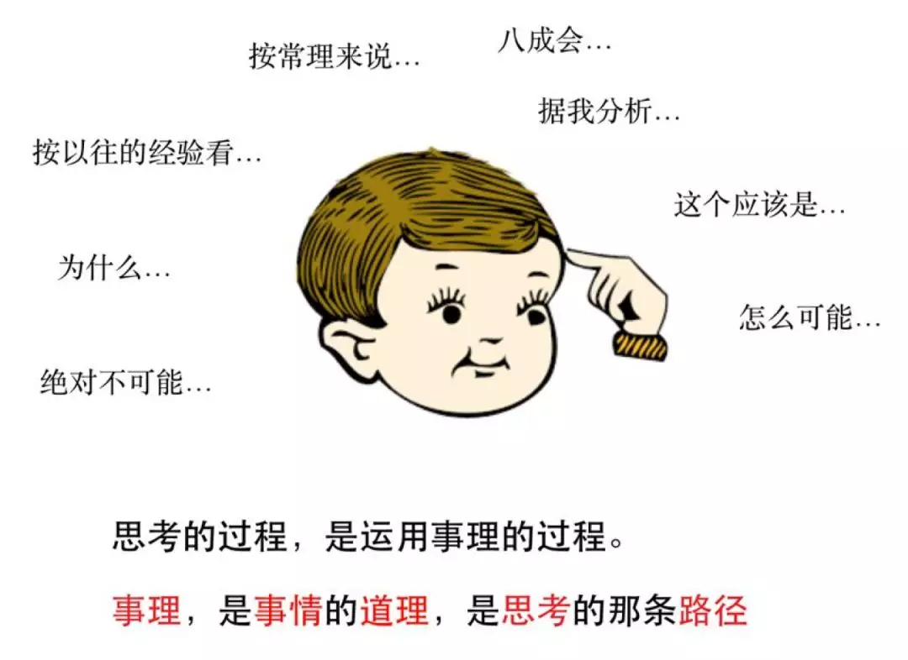

事理图谱
======
#### 一、事理图谱概念
>人们每天的活动在不知不觉间进行。实际上，每个人的头脑里都有一个隐形的事理图谱，人们据此展开每天的行为活动。

- 事理图谱（Event Evolutionary Graph）是一个描述事件之间顺承、因果关系的事理演化逻辑有向图。  
- 事理图谱旨在揭示事件间的逻辑演化规律与模式，作为对人类行为活动的直接刻画。  
- 事理图谱的研究目标是将事件演化规律和模式组织成一个大型事理常识知识库，这个知识库是人类行为活动的真实刻画。

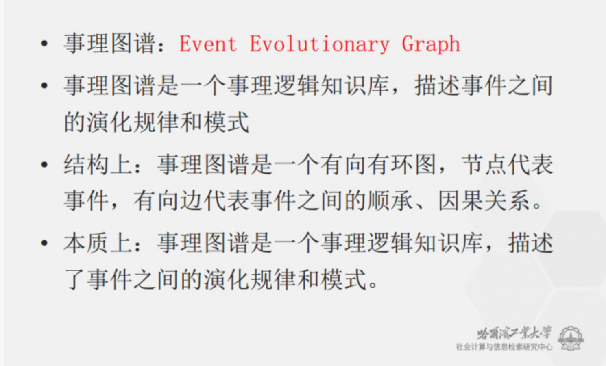

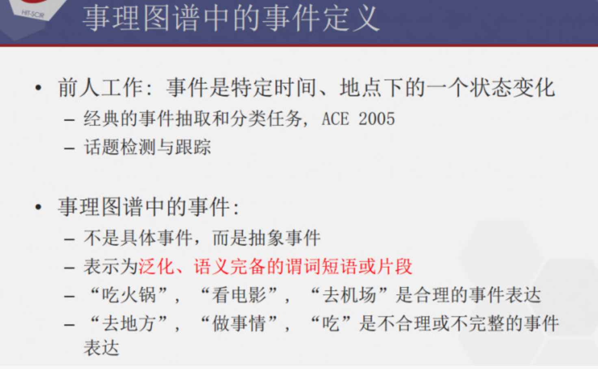

事理逻辑（事件间关系）的主要包括7种类型：  
因果事理、条件事理、反转事理、顺承事理、顺承事理、上下位事理、组成事理、并发事理
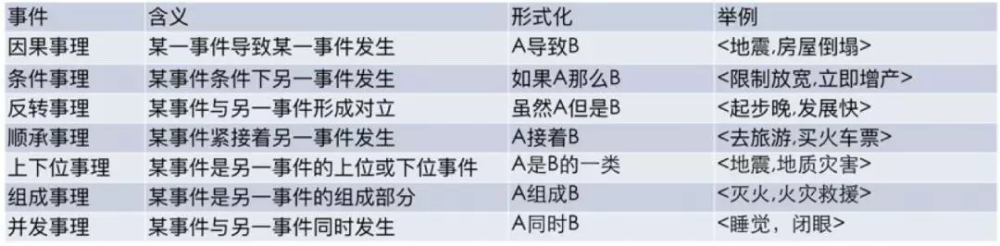
>- 因果事理， 在满足顺承关系时序约束的基础上，两个事件间有很强的因果性，强调前因后果；  
>- 条件事理， 描述的是认知体系中的一种条件结果关系，是一种预设与结果逻辑；
>- 反转事理， 往往描述的是认知体系中的一种互斥逻辑，是一种真假值逻辑；
>- 顺承事理， 两个事件在时间上先后发生的偏序关系；
>- 组成事理， 刻画的是事件之间整体与部分的逻辑；
>- 上下位事理， 描述的是事件在分类体系中一种逻辑；
>- 并发事理， 描述的是事件在时间上的一种共生关系，指一个事件发生下另一个事件一定发生。

事件表示：事件六要素本体模型  
将事件建模成e = { A，O，T，V，P，L}的表示形式  
其中：A 为动作要素; O 为对象要素; T 为时间要素; V 为环境要素; P 为断言要素；L 为语言表现

事理图谱有3种典型的拓扑结构：  
- 第一种是链状，顺承关系为典型代表；  
- 第二种是树状，这其中有一种事件是心理事件，打算去做某事，并不是真做了；  
- 第三种是环状，以打架报复住院为例，循环往复。
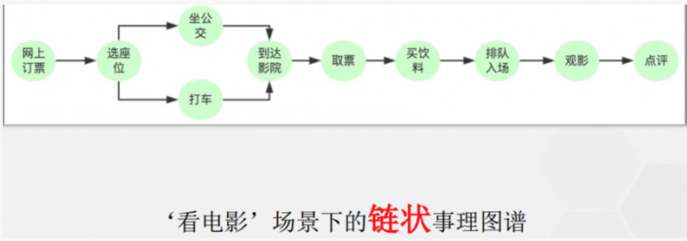
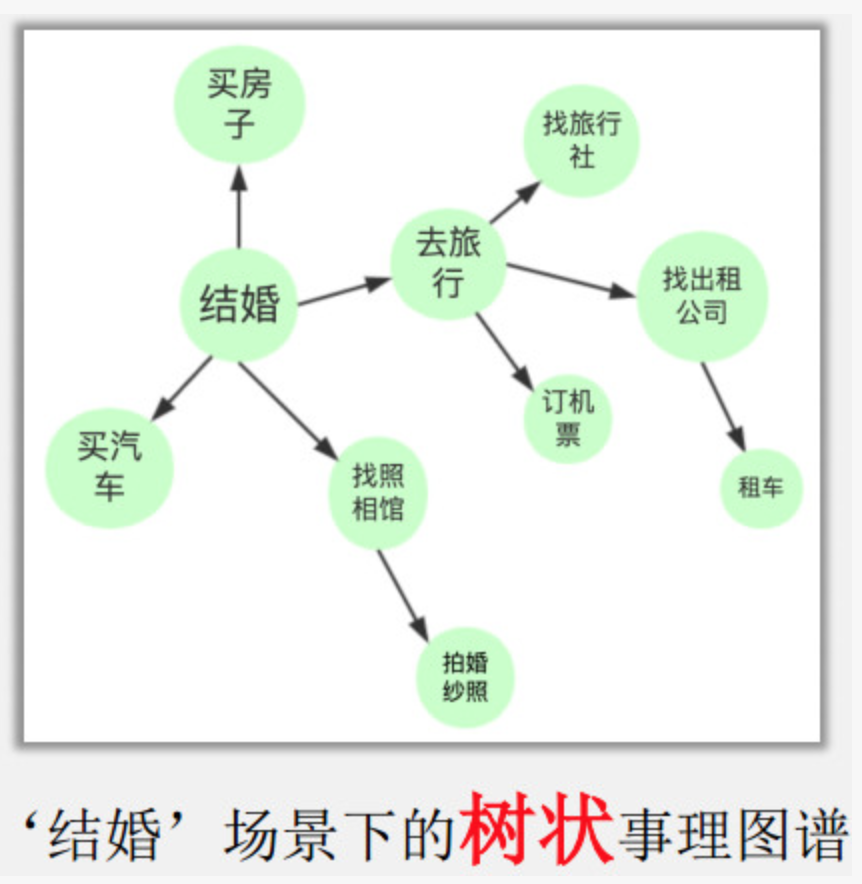
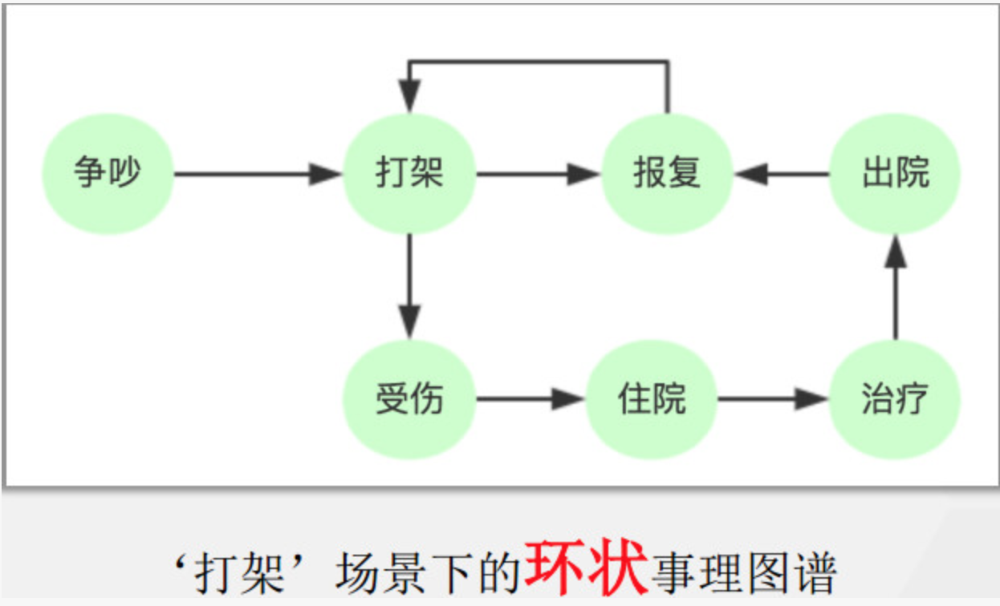

#### 二、事理图谱应用
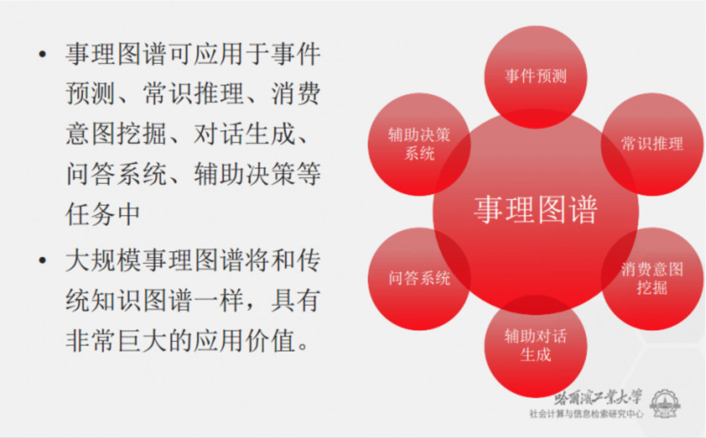

#### 三、事理图谱与知识图谱区别
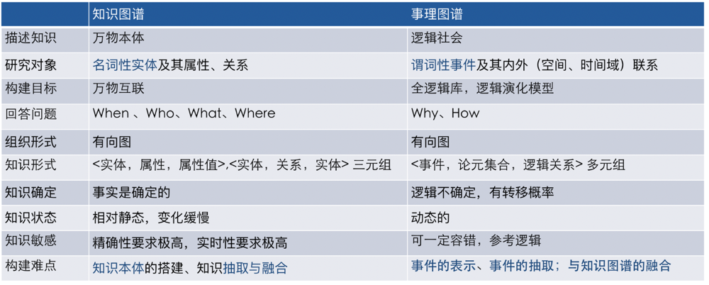
- 事理图谱以事件为核心研究对象，有向边只表示两种事理关系，即顺承和因果；
- 边上标注有概率信息说明事理图谱是一种事件间相继发生可能性的刻画，不是确定性关系。
- 而知识图谱以实体为核心研究对象，实体属性以及实体间关系种类往往成千上万。
- 知识图谱以客观真实性为目标，某一条属性或关系要么成立，要么不成立。   

#### 四、事理图谱的构建过程
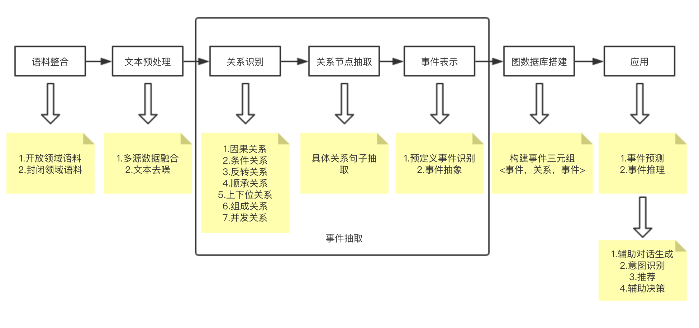

#### 五、相关工作发展
- 统计脚本学习
    - 关注事件链条的抽取，事件预测以及事件间转移概率的建模。
    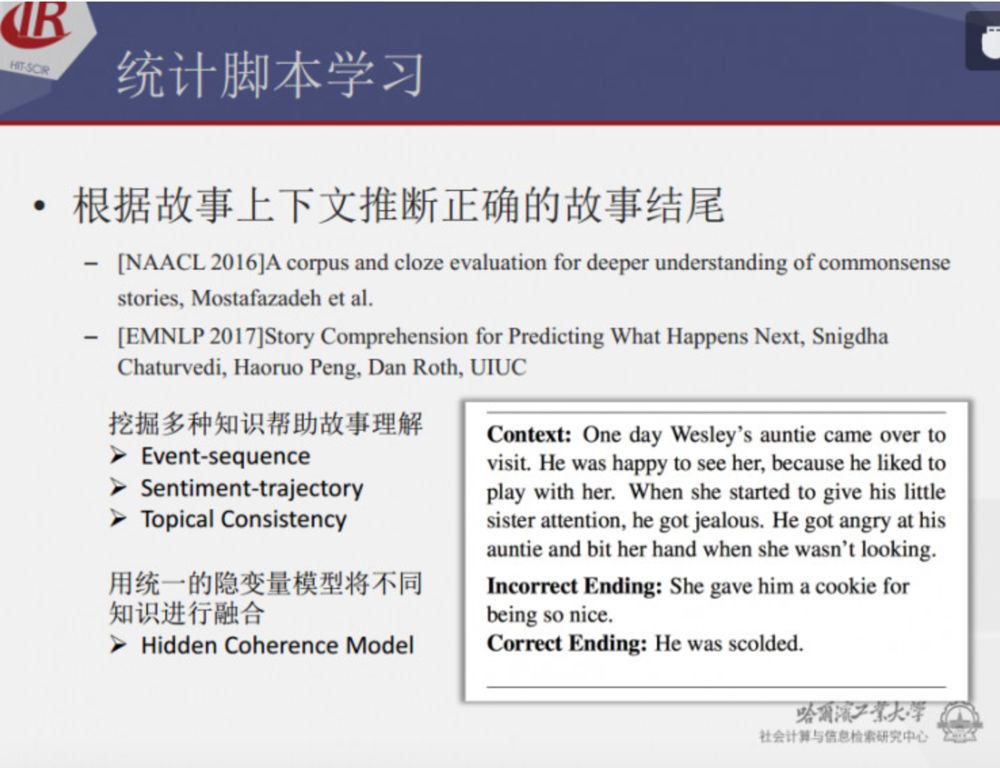
- 事件间时序因果关系识别
    - 关注如何识别它们之间的时序、因果关系以及关系方向。
    - 一些成果：
        - 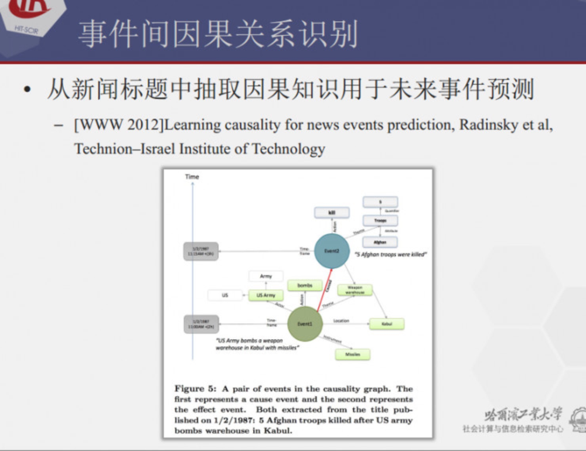
        - 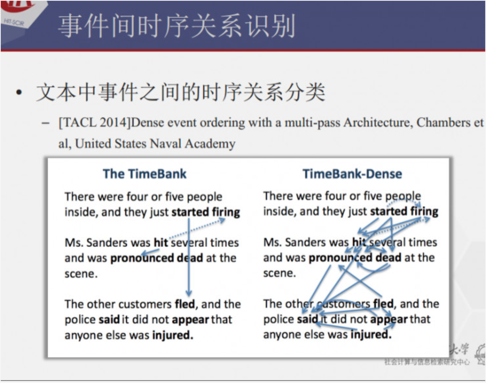    