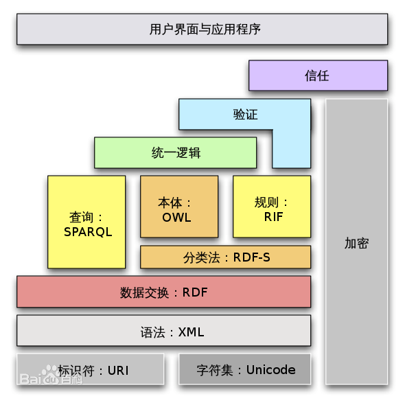
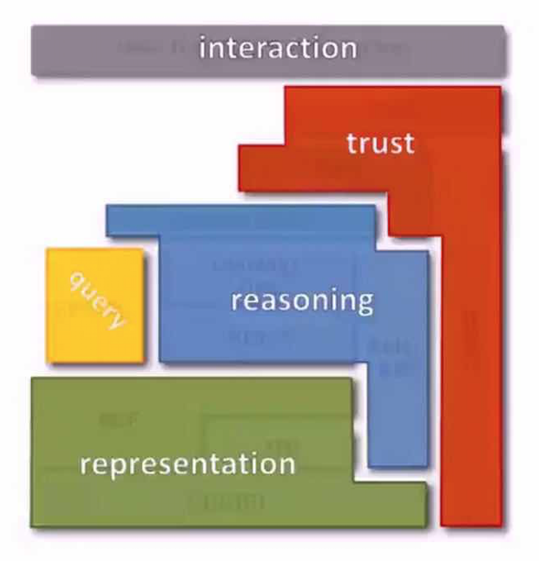
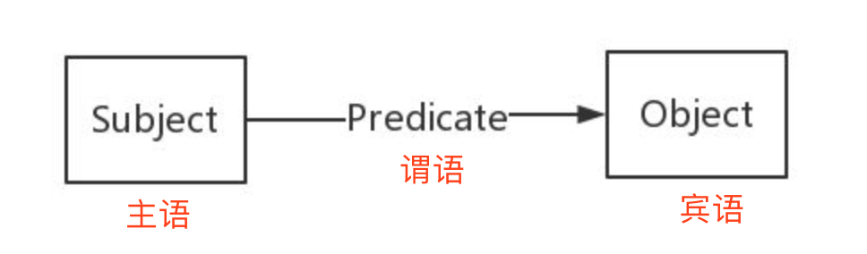
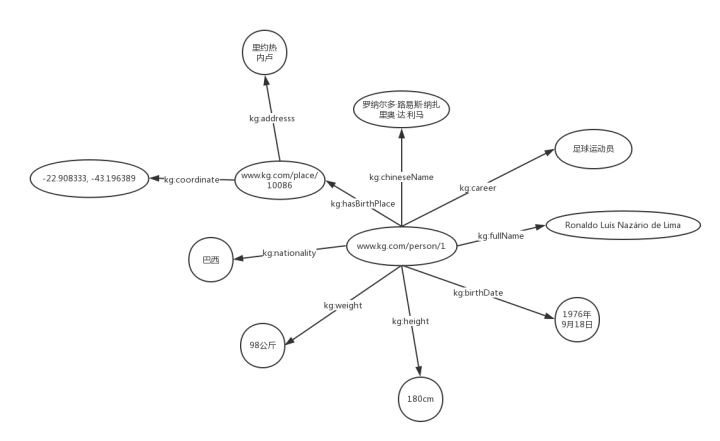
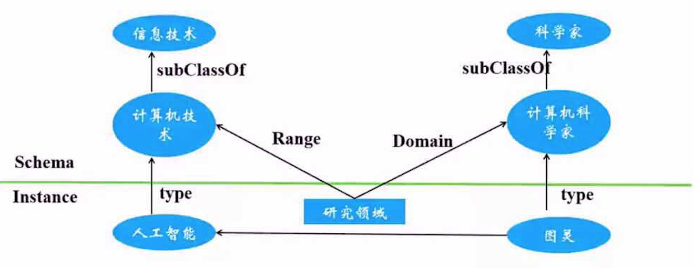

知识图谱--技术篇
====
数据来源
----
- 文本 -》KBP
- 结构化数据库 -》D2R
- 多媒体 -》Linked Media /Visual Genome
- 传感器 -》OneM2M
- 众包  -》WikiData
 
技术体系
------
目标：更规范的数据表示，更强的数据关联
- 知识表示
- 知识问答
- 语义搜索
- 可视化
- 知识链接
- 知识推理
- 知识众包
- 知识融合
- 知识抽取

知识表示
----
研究如何利用计算机符号表示人脑中知识，如何通过符号运算模拟人脑的推理过程。

历史演变：基于数理逻辑的知识表示-》基于向量空间学习的分布式知识表示
  
技术框架：  

## RDF:Resourse Description Framework 资源描述框架

SPO三元组： 
RDF由节点和边组成，节点（主语、宾语）表示实体/资源、属性，边（谓语）则表示了实体和实体之间的关系以及实体和属性的关系。

RDF Graph
基本数据类型：有向标记图  

*为了解决RDF中物体A和B间既有实体与实例关系，又有父类与子类关系的问题出现了RDFS/OWL两种描述语言
#### RDFS:Resource Description Framework Schema  模式语言

schema相当于数据库中的表，instance相当于表中的一行数据

   
常用预定义词汇总结： 

    1. rdfs:Class. 用于定义类。
    
    2. rdfs:domain. 用于表示该属性属于哪个类别。
    
    3. rdfs:range. 用于描述该属性的取值类型。
    
    4. rdfs:subClassOf. 用于描述该类的父类。比如，我们可以定义一个运动员类，声明该类是人的子类。
    
    5. rdfs:subProperty. 用于描述该属性的父属性。比如，我们可以定义一个名称属性，声明中文名称和全名是名称的子类。

Notice：
- rdfs不区分数据属性和对象属性

#### OWL：Web Ontology Language 本体语言
  
主要作用：  
1. 提供快速、灵活的数据建模能力。
2. 高效的自动推理。

常用词汇总结：
    
    描述属性特征的词汇
    
    1. owl:TransitiveProperty. 表示该属性具有传递性质。例如，我们定义“位于”是具有传递性的属性，若A位于B，B位于C，那么A肯定位于C。
    
    2. owl:SymmetricProperty. 表示该属性具有对称性。例如，我们定义“认识”是具有对称性的属性，若A认识B，那么B肯定认识A。
    
    3. owl:FunctionalProperty. 表示该属性取值的唯一性。 例如，我们定义“母亲”是具有唯一性的属性，若A的母亲是B，在其他地方我们得知A的母亲是C，那么B和C指的是同一个人。
    
    4. owl:inverseOf. 定义某个属性的相反关系。例如，定义“父母”的相反关系是“子女”，若A是B的父母，那么B肯定是A的子女。
    
    本体映射词汇（Ontology Mapping）
    
    1. owl:equivalentClass. 表示某个类和另一个类是相同的。
    
    2. owl:equivalentProperty. 表示某个属性和另一个属性是相同的。
    
    3. owl:sameAs. 表示两个实体是同一个实体。

Notice:
- RDFS的扩展 ，添加了额外的预定义词汇。
- owl区分数据属性和对象属性 

#### RDFa 在网页中嵌入语义数据

#### SPARQL

KG Embedding 知识图谱的分布式表示
------
离散的符号表示（人类更好理解）-》连续的向量表示（机器更好计算）  
在保留语义的同时，将知识图谱中的实体和关系映射到连续的稠密的低维向量空间

#### 主流方法
- 张量分解出三元关系
- 神经网络学习三元组
- 距离模型（翻译模型）

知识抽取：NLP+KR
------

#### 主流方法

- 知识工程
  
  - 正则表达式
  - 模版匹配
  - 规则约束
    
    - POS
    - NER 约束
    - 距离约束
  
- 基于本体的抽取

    - 知识挖掘  
        
        - PRA 基于图的抽取
        - TransE 系列基于 Embedding 的抽取

- 基于模型的抽取
    
    - 模型
        
        - SVM，Logistic Model
        - 条件随机场（CRF）
        - LSTM 循环神经网络
    
    - 训练
    
        - 监督学习
        - 无监督学习
        - 远程监督，从已有知识库获取少量训练数据
        
知识存储
------
知识存储-结构化、索引、查询（支持推理）优化  
图的存储并非必须的，可以是混合存储结构

知识问答
-------
KBQA（Knowledge-Based Question Answering）基于知识库的问题回答  
以直接而准确的方式回答用户用自然语言提问的自动问答系统，将构成下一代搜索引擎的基本形态

流程：

用户提问-》语义解析-》问题的语义表示-》查询知识库-》返回答案

知识推理
-------
基于已知事实推出未知事实的过程

- 基于描述逻辑的推理：本体推理
- 基于统计规则挖掘的推理
- 基于表示学习的推理

知识融合
-------
在不同数据集中找出同一个实体的描述记录，主要目的是对不同数据源中的实体信息进行整合，形成更加全面的实体信息  

典型工具：
- Dedupe（要求两个数据集有相似结构）
- LIMES （不要求相似结构，专门为链接数据设计的数据框架）

知识图谱应用
-------
- 医疗健康
    
    - Open PHACTS 欧盟研发关于药物研发知识库，用于发现新药等
    - 中医药知识服务平台 
- 金融

    - 人际关系图谱、资金资本图谱、事件图谱、公司图谱等用于反欺诈，征信等分析
- 电商

    - 阿里巴巴知识图谱，用于货品上架信息审核等
- 出版/媒体

    - 出版新闻等
    - 报道奥运会信息
    - BBC打通不同领域的知识
- 农业
- 政府
- 电信
- 数字图书馆
- 博物馆 

    - 语义搜索、整合虚拟知识图谱
- 企业知识图谱

知识图谱评价指标
-------
1。规模
2。质量
3。问答-》回答完整、准确程度

    

             
   

