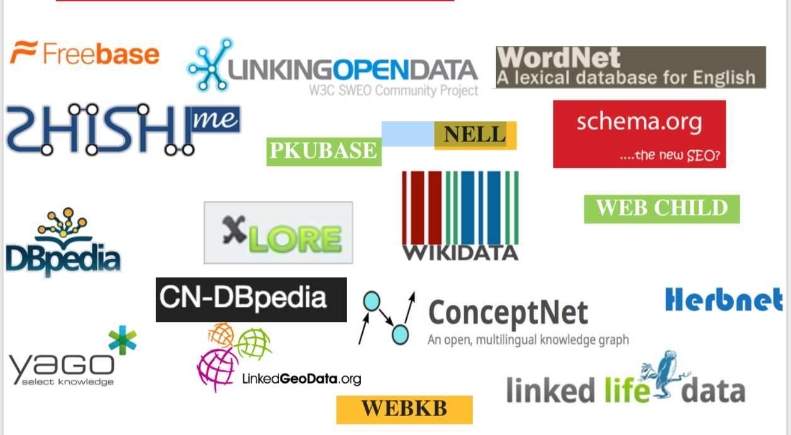

知识图谱--概念篇
======

>知识对于AI的价值：“有了知识的人工智能会变得更强大，可以做更多的事情。反过来，因为更强大的人工智能，可以帮我们更好地从客观世界中去挖掘、获取和沉淀知识，这些知识和人工智能系统形成正循环，两者共同进步。”--百度副总裁王海峰

知识的价值:
- 第一，知识让机器具有认知能力。
- 第二，知识可以让机器与人类对话。
- 第三，知识可以让机器智能决策。

如何给机器输入知识？核心技术就是知识图谱。
> “如果知识是人类进步的阶梯，知识图谱就是AI进步的阶梯”--百度副总裁王海峰

知识图谱：通过不同知识的关联性形成成一个网状的知识结构。
  
一.  历史
-----

> 人的记忆偏重关联

- 1960 -》 **语义网络**（Semantic Networks）
    作为一种知识表示方式出现，用于自然语言理解领域  
- 1980s -》 **本体论**（Ontology）
    哲学概念引入AI领域刻画知识  
- 1989 -》 **Web** Tim Berners-Lee 发明万维网
- 1998 -》 **语义网** （Semantic Web）从超文本链接到语义链接
- 2006 -》 **链接数据** （Linked Data）Tim 强调语义网本质是要建立开放数据之间的链接
- 2012 -》 **知识图谱** （Knowledge Data）谷歌发布基于知识图谱的搜索引擎产品

Notice： 
- 知识表示（Knowledge Representation）、知识库(Knowledge Base)（类似于数据库又高于数据库的方便形成推理和智能的仓库）也在这 60s 年中一直发展
- 知识图谱得益于 Web 发展，有来源于 KR、NLP、AI、Web 多个方面的基因

二. 作用
----
- 辅助搜索  
    - 网页搜索-》语义搜索  
    - 文档/网页链接-》数据链接  
    - 技术包括：手工众包、格式转换、（文本、半结构化数据）元组抽取、（来源不同、异构数据）实体融合、（数据不全）链接预测、推理补全、语义嵌入

- 辅助问答  
机器人及IOT设备智能化
     - 智能助手
     - 智能家具
     - 智能驾驶

- 辅助决策
    - 政府决策 （Palantir）
    - 金融界事件抽取，对股市和行情进行把控，对量化投资有很大意义 （Kensho） 
    - 金融应用：个人征信、贷款风控、保险销售、保险策划、金融指数、反欺诈、客户管理管理、智能客服等领域 （度小满）  

> 当一个人听到或看到一句话时，他使用自己所有的知识和智能去理解。这不仅包括语法，还包括他的词汇知识、上下文知识，最重要的是对相关事务的理解。 ---Terry Winograd
- 辅助AI  
使人工智能具有常识推理能力

- 个性化推荐

- 知识图谱的应用场景远远不止这些，它是AI的基石，理论上来说每一个AI场景都是知识图谱的场景，而AI将改变各行各业

三. 本质
------
多方面技术的一个大杂烩

- Web：建立数据间语义链接
- NLP：从文本中抽取语义、结构化数据
- KR：利用计算机符号表示、处理知识
- AI：利用知识库辅助理解人类语言
- DB：用图的方式存储知识

四. 知识图谱项目
---
- [WordNet](https://wordnet.princeton.edu/)（英文词典知识库）
- [Freebase](http://www.freebase.be/)（谷歌开放知识库（停止维护））
- [WIKIDATA](https://www.wikidata.org/wiki/Wikidata:Main_Page) （世界最大免费知识库-维基众包知识库）
- [DBpedia](https://wiki.dbpedia.org/)
- [ConceptNet](http://www.conceptnet.io/)（微软概念知识库）
- [Babelnet](https://babelnet.org/)（多语言词典知识库）
- [OpenKG](http://www.openkg.cn/) （中文知识库）
- [Zhishi.me](http://zhishi.me/) (中文知识库-来源于维基百科，百度百科，互动百科三者融合)
- [cnSchema](http://cnschema.org/) （中文知识图谱）
- [Herbnet](https://www.herbnet.com/)（中草药知识库）
- 

   
     